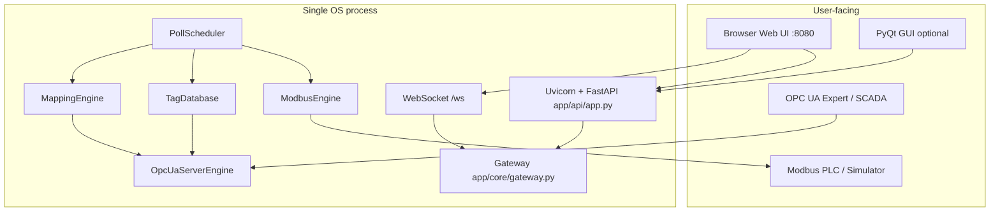

# Complete System Reference — Modbus ↔ OPC UA Gateway

**Product:** `aa-modbus-ua-gateway` (`app/` package)  
**Author:** Aman Anand, M (T&I), Barauni  
**Audience:** Operators, integrators, and maintainers who need **what / why / where / how** in one place.

This document describes the **current** gateway as implemented under `D:\3. Gateways\OPC-MODBUS` (greenfield `app/` tree), including the **browser configuration UI**, **REST APIs**, **portable EXE**, and **Windows startup** support built in this project.

---

## Table of contents

1. [What this system is](#1-what-this-system-is)
2. [Design principles (why it is built this way)](#2-design-principles-why-it-is-built-this-way)
3. [Repository layout](#3-repository-layout)
4. [Runtime architecture](#4-runtime-architecture)
5. [How the program starts and runs](#5-how-the-program-starts-and-runs)
6. [Configuration: file, schema, apply pipeline](#6-configuration-file-schema-apply-pipeline)
7. [End-to-end data flow (Modbus → tags → OPC UA → Web)](#7-end-to-end-data-flow-modbus--tags--opc-ua--web)
8. [Gateway Core modules](#8-gateway-core-modules)
9. [Modbus engine](#9-modbus-engine)
10. [OPC UA engine](#10-opc-ua-engine)
11. [Embedded Web UI](#11-embedded-web-ui)
12. [REST API — complete catalog](#12-rest-api--complete-catalog)
13. [WebSocket API](#13-websocket-api)
14. [Security and roles](#14-security-and-roles)
15. [Persistence, backup, audit](#15-persistence-backup-audit)
16. [Trends, history, communication monitor](#16-trends-history-communication-monitor)
17. [Tag import/export (CSV/Excel)](#17-tag-importexport-csvexcel)
18. [CLI, EXE, and Windows startup](#18-cli-exe-and-windows-startup)
19. [PyQt desktop GUI (optional)](#19-pyqt-desktop-gui-optional)
20. [Build and release artifacts](#20-build-and-release-artifacts)
21. [Legacy `gateway/` package](#21-legacy-gateway-package)
22. [Related documentation index](#22-related-documentation-index)

---

## 1. What this system is

An **industrial protocol gateway** that:

| Function | Description |
|----------|-------------|
| **Modbus** | Polls or serves devices over **TCP** and **RTU** (client/server modes) plus an internal **simulator**. |
| **OPC UA** | Exposes mapped tags on an **OPC UA server**; optional **OPC UA clients** for upstream systems. |
| **Mapping** | Converts register raw values ↔ engineering values (datatype, byte/word order, gain/offset, deadband). |
| **Web UI** | Browser pages on `http://127.0.0.1:8080` to monitor tags, configure devices/tags, import CSV/Excel, view trends/history/traffic. |
| **REST + WebSocket** | Machine-readable API for SCADA, scripts, and the Web UI (Web UI does **not** call pymodbus/asyncua directly). |
| **Packaging** | Single-file **`ModbusOPCUAGateway.exe`** with embedded templates/static and portable `config/` beside the EXE. |

**Single source of truth:** `Gateway` in `app/core/gateway.py` owns tag values, config document, scheduler, and protocol engines.

---

## 2. Design principles (why it is built this way)

| Principle | Why |
|-----------|-----|
| **Core owns all tag state** | One `TagDatabase` prevents GUI/Web/OPC UA from diverging. |
| **Web/GUI are clients** | `app/web` and `app/gui` use HTTP only — no duplicate Modbus/OPC UA logic. |
| **Asyncio for I/O** | pymodbus async TCP and asyncua share one event loop in headless/EXE mode. |
| **Poll groups, not per-tag threads** | `PollScheduler` runs one asyncio task per **poll group** (e.g. `default` 1000 ms, `fast` 500 ms). |
| **YAML + Pydantic** | Human-editable config with strict validation (`app/core/config_schema.py`). |
| **Fail-soft on devices** | One offline PLC does not stop the process; connect errors are logged per device (`app/modbus/base.py`). |
| **OPC UA bind failures are non-fatal** | Modbus + Web continue if port 4840/4841 is blocked (`gateway.start()` catches `OSError`). |
| **In-memory trends/history** | Lightweight operator views — **not** a plant historian (5 min / ~300 samples). |

---

## 3. Repository layout

```
OPC-MODBUS/
├── app/                          # Main product (use this)
│   ├── cli.py                    # Entry: --run, --validate, --gui, --portable, --browser, --service
│   ├── main.py                   # asyncio: load gateway, uvicorn, run_until_stopped
│   ├── core/                     # Gateway Core (SSOT)
│   ├── modbus/                   # Device drivers, codec, diagnostics, frame hex
│   ├── opcua/                    # Server, client, certificates
│   ├── api/                      # FastAPI app, routes, WebSocket
│   ├── web/                      # Jinja2 templates + static JS/CSS
│   ├── gui/                      # PyQt5 (optional)
│   ├── service/                  # Windows service helper
│   └── utils/                    # logging, runtime_paths (PyInstaller)
├── config/
│   └── gateway.yaml              # Active configuration (devices, tags, poll_groups, opcua, web)
├── data/gateway.db               # SQLite (audit, events, config revisions) — created at runtime
├── backup/                       # Timestamped YAML backups before apply
├── logs/                         # Rotating log files
├── examples/                     # Sample YAML, tags_import_template.csv
├── scripts/
│   ├── package_release.bat       # Build EXE + portable zip
│   ├── windows/                  # Install-GatewayStartup.ps1 (boot service)
│   └── portable/                 # START_GATEWAY.bat, INSTALL_STARTUP_SERVICE.bat
├── build/gateway.spec            # PyInstaller spec
├── tests/                        # pytest + acceptance
├── docs/                         # Manuals (this file, WEB_UI_MANUAL, DEPLOYMENT, …)
└── gateway/                      # LEGACY reference poller — do not extend
```

**Where code lives vs where config lives**

| Concern | Location | Writable at runtime? |
|---------|----------|----------------------|
| Program logic | `app/**/*.py` | No (or EXE bundle) |
| Operator config | `config/gateway.yaml` | Yes |
| Runtime DB | `data/gateway.db` | Yes |
| Backups | `backup/*.yaml` | Yes |
| Import uploads | `imports/` (API) | Yes |
| Web assets (dev) | `app/web/static`, `templates` | Dev only |
| Web assets (EXE) | Extracted under `_MEIPASS/app/web/` | Read-only |

---

## 4. Runtime architecture



**Threading model (headless / EXE):** one **asyncio** event loop on the main thread. `PollScheduler` uses `asyncio.create_task` per poll group. `CommunicationMonitor` and `TagDatabase` use `threading.RLock` for safe access from sync callbacks.

---

## 5. How the program starts and runs

### 5.1 Development (Python)

```bat
python -m app --run --config config\gateway.yaml
```

**Sequence** (`app/main.py`):

1. `Gateway(config_path)` constructed.
2. `await gateway.load()` — read YAML, build tag DB, Modbus engine, OPC UA server, scheduler.
3. `configure_logging()` — files under `logs/`.
4. `await gateway.start()` — connect Modbus, start OPC UA server, start scheduler tasks.
5. If `web.enabled`, `create_app(gateway)` + `uvicorn.Server.serve()` as asyncio task.
6. `await gateway.run_until_stopped()` until Ctrl+C.
7. `await gateway.stop()` — stop scheduler, OPC UA, Modbus.

### 5.2 Portable EXE (double-click)

**File:** `dist/ModbusOPCUAGateway.exe`  
**Logic:** `app/cli.py` — if frozen and no argv → `["--run", "--portable", "--browser"]`.

| Flag | Effect |
|------|--------|
| `--portable` | `chdir` to EXE folder; seed `config/gateway.yaml` from bundle if missing (`app/utils/runtime_paths.py`). |
| `--browser` | After 2 s, open `http://127.0.0.1:8080/` (`webbrowser` module). |
| **No** `--browser` | Used for background startup (`INSTALL_STARTUP_SERVICE.bat`). |

### 5.3 Windows startup (background)

See `docs/WINDOWS_STARTUP_SERVICE.md`. Installs Scheduled Task or NSSM service running:

`ModbusOPCUAGateway.exe --run --portable --config config\gateway.yaml`

---

## 6. Configuration: file, schema, apply pipeline

### 6.1 Primary file

**Path:** `config/gateway.yaml` (or beside EXE in portable mode).

**Root model:** `GatewayDocument` in `app/core/config_schema.py`.

Major sections:

| YAML key | Purpose |
|----------|---------|
| `gateway` | `name`, `mode` |
| `web` | `enabled`, `host`, `port`, `remote_enabled` (non-loopback needs explicit flag) |
| `logging` | `level`, `json_logs` |
| `poll_groups` | List of `{ id, interval_ms, priority }` — scheduler intervals |
| `modbus.devices` | Device definitions (name, mode, host/port or serial, `enabled`, timeouts) |
| `tags` | Tag definitions (device, function, address, datatype, scaling, `poll_group`, `opcua_node`) |
| `mappings` | Optional advanced mapping rules |
| `opcua.server` | Endpoint, security, namespace |
| `opcua.clients` | Optional upstream OPC UA clients |
| `security` | `require_auth`, users |

### 6.2 Validation

- **CLI:** `python -m app --validate --config config\gateway.yaml`
- **API:** `POST /api/config/validate` with JSON body
- **On save:** every `persist_document()` and `ConfigManager.apply()` runs Pydantic validation.

Cross-rules (examples): tag must reference existing device and poll group; duplicate tag names rejected.

### 6.3 Apply pipeline (why changes take effect)

**Browser CRUD** (devices/tags/poll groups) calls `gateway.persist_document()` (`app/core/gateway.py`):

1. Validate document.
2. `ConfigManager.apply_with_store()` — backup to `backup/`, write YAML, SQLite revision row.
3. `audit.record()`.
4. `await reload_config()` — stop scheduler/OPC UA/Modbus, `load()` again, reconnect, restart scheduler.

**Why reload:** Modbus device list, tag addresses, and poll intervals are compiled into engines at `load()` time; hot-patch without reload would leave stale connections or wrong OPC UA nodes.

**Config editor logic:** `app/core/config_editor.py` (pure functions on `GatewayDocument` — add/update/remove device, tag, poll group, merge import).

---

## 7. End-to-end data flow (Modbus → tags → OPC UA → Web)

### 7.1 Poll cycle (one tag)

**Where:** `app/core/scheduler.py` → `_poll_one()`

1. Skip if tag disabled or **device `enabled` is false**.
2. Build synthetic **Tx PDU hex** (`app/modbus/frame_codec.py`).
3. `device.read(unit_id, area, internal_address, register_count)` via pymodbus.
4. Build **Rx PDU hex** from registers or error.
5. On failure: update tag quality `COMMUNICATION_FAILURE`, log comm record.
6. `decode_tag_value(registers, tag_def)` — `app/core/datatype_engine.py` + byte/word order.
7. Log comm record with **engineering value** (diagnostics/traffic pages).
8. **`tags.update_value(..., registers=...)`** — always on successful decode (UI updates every poll).
9. **`mapping.should_publish()`** — deadband/direction; if true, `opcua_server.update_from_tag()`.

**Important fix (why UI was “stuck”):** Tag DB update is **not** gated by `should_publish()`. OPC UA updates still respect deadband.

**Trend/history:** `TagDatabase.update_value()` calls `TrendBuffer.record()` and `TagHistoryBuffer.record()` when quality is `GOOD`.

### 7.2 Web read path

1. Browser `fetch('/api/tags')` or WebSocket payload `tags`.
2. `gateway.tags.snapshot()` — list of `TagRecord.to_dict()` (name, value, quality, device, timestamps, opcua_node).

### 7.3 Write path (API or OPC UA)

- **REST:** `PUT /api/tags/{name}` → `gateway.write_tag()` → `scheduler.write_tag()` → Modbus write → tag DB → OPC UA mirror.
- **OPC UA client write** to server variable → server engine calls core write path (when writable).

---

## 8. Gateway Core modules

| Module | File | What | How |
|--------|------|------|-----|
| **Gateway** | `gateway.py` | Facade: load/start/stop/reload/persist/status/write_tag | Orchestrates all subsystems |
| **ConfigManager** | `config_manager.py` | Load YAML, validate, backup, write file | Pydantic + shutil copy to `backup/` |
| **Config schema** | `config_schema.py` | `GatewayDocument`, devices, tags, poll groups | Pydantic models |
| **Config editor** | `config_editor.py` | CRUD mutations for API layer | Returns new validated document |
| **TagDatabase** | `tag_database.py` | Runtime tag values + metadata | Built from config; `update_value` feeds trends/history |
| **MappingEngine** | `mapping_engine.py` | Deadband, direction, OPC UA publish gating | Used by scheduler only for OPC UA push |
| **PollScheduler** | `scheduler.py` | Grouped async poll loops | `interval_ms` per `poll_group` |
| **TrendBuffer** | `trend_buffer.py` | ~300 numeric samples/tag for charts | In-memory deque |
| **TagHistoryBuffer** | `tag_history.py` | 5-minute table history with raw hex + byte order | Pruned by timestamp |
| **EventManager** | `event_manager.py` | Operator event list | Optional SQLite persistence |
| **AuditManager** | `audit_manager.py` | Who changed what | SQLite |
| **HealthMonitor** | `health_monitor.py` | Uptime in `/api/status` | Started with gateway |
| **Persistence** | `persistence.py` | `SqliteStore` — revisions, audit, events | `data/gateway.db` |
| **BackupStore** | `backup_store.py` | List/restore backup files | Filesystem under `backup/` |
| **Import/export** | `import_export.py` | CSV/Excel → `TagDefinition` rows | Used by config API |

---

## 9. Modbus engine

**Factory:** `app/modbus/factory.py` → `build_modbus_engine(doc)` registers devices in `ModbusEngine`.

| Mode | Implementation file | Role |
|------|---------------------|------|
| `tcp_client` | `tcp_client.py` | Poll external PLC |
| `tcp_server` | `tcp_server.py` | Gateway acts as Modbus TCP slave |
| `rtu_client` / `rtu_server` | `rtu_client.py`, `rtu_server.py` | Serial |
| `simulator` | `simulator_device.py` | Built-in memory map for tests |

**Addressing:** `app/core/addressing.py` — PLC-style address (e.g. 40001) → internal 0-based + `RegisterArea`.

**Diagnostics:** `ModbusDiagnostics` + `CommunicationMonitor` (`modbus/diagnostics.py`) — manual read/write API and poll logging.

**Connect policy:** `connect_all()` catches per-device errors so config save is not blocked by one bad IP.

---

## 10. OPC UA engine

**Server:** `app/opcua/server.py` — `OpcUaServerEngine`

- Builds namespace from `doc.opcua.server`.
- Creates object per device, variable per tag (`opcua_node` string, default `s={device}/{tag}`).
- Bind retries on alternate host/port; failure emits event, does not kill gateway.
- Variant types match tag datatype (fix for int16 scaled as Double).

**Client:** `app/opcua/client.py` — optional outbound clients from config.

**Certificates:** `app/opcua/certificates.py` — exposed via `/api/certificates`.

---

## 11. Embedded Web UI

**Server:** FastAPI `create_app()` in `app/api/app.py` mounts `/static`, renders Jinja2 from `app/web/templates/`.

| URL path | Template | Static JS | Purpose |
|----------|----------|-----------|---------|
| `/` | `dashboard.html` | `app.js`, Chart.js CDN | Live tags, sparklines, events |
| `/devices` | `devices.html` | `config.js` | Add/edit/delete Modbus devices, polling enable |
| `/tags` | `tags.html` | `config.js`, `live.js` | Add/edit/delete tags; live values ~750 ms |
| `/import` | `import.html` | `config.js` | CSV/Excel import preview/commit |
| `/polling` | `polling.html` | `config.js` | Edit poll group intervals |
| `/trends` | `trends.html` | `live.js`, Chart.js | Per-tag line chart |
| `/history` | `history.html` | `live.js`, `config.js` | 5-minute tabular history |
| `/traffic` | `traffic.html` | inline | Modbus Tx/Rx PDU hex |
| `/diagnostics` | `diagnostics.html` | `live.js` | Comm monitor + tag value |
| `/events` | `events.html` | — | Event list |

**Shared client scripts**

| File | Role |
|------|------|
| `app/web/static/live.js` | `LIVE_TAG_POLL_MS = 750`, `fetchLiveTags()`, `startLiveTags()` |
| `app/web/static/config.js` | `apiGet/Post/Put/Delete`, device/tag tables, edit dialogs |
| `app/web/static/app.js` | Dashboard WebSocket + REST fallback |

**OpenAPI:** `http://127.0.0.1:8080/docs` (interactive Swagger).

---

## 12. REST API — complete catalog

Base URL: `http://{web.host}:{web.port}` (default `http://127.0.0.1:8080`).

**Auth:** If `security.require_auth` is true, write endpoints expect header `Authorization: Bearer <token>` from `POST /api/auth/login`. Dependency `_session` in `app/api/app.py` resolves username (or `anonymous`).

### 12.1 HTML pages (GET)

| Method | Path | Handler location | Does |
|--------|------|------------------|------|
| GET | `/` | `app.py` | Dashboard |
| GET | `/tags` | `app.py` | Tag management UI |
| GET | `/devices` | `app.py` | Device management UI |
| GET | `/import` | `app.py` | CSV/Excel import UI |
| GET | `/events` | `app.py` | Events UI |
| GET | `/diagnostics` | `app.py` | Communication monitor UI |
| GET | `/trends` | `app.py` | Trend charts UI |
| GET | `/traffic` | `app.py` | Hex traffic UI |
| GET | `/polling` | `app.py` | Poll group editor UI |
| GET | `/history` | `app.py` | History table UI |
| GET | `/examples/tags_import_template.csv` | `app.py` | Download sample CSV (`FileResponse`) |

### 12.2 Runtime / monitoring

| Method | Path | Auth | Request | Response | Implementation |
|--------|------|------|---------|----------|----------------|
| GET | `/api/status` | No | — | `{ gateway, health, modbus, tags_count }` | `gateway.status()` |
| GET | `/api/tags` | No | — | `[{ name, value, quality, device, … }]` | `tags.snapshot()` |
| GET | `/api/tags/{tag_name}` | No | — | Single tag dict | `tags.get()` |
| PUT | `/api/tags/{tag_name}` | Write | `{ "value": … }` | `{ ok: true }` | `gateway.write_tag()` → Modbus write |
| GET | `/api/devices` | No | — | Modbus device connection stats | `modbus.status()` |
| GET | `/api/modbus/status` | No | — | Same as devices | `modbus.status()` |
| GET | `/api/opcua/status` | No | — | Server running, endpoint, clients | `opcua_server` state |
| GET | `/api/events` | No | — | Event list | `events.list_events()` |
| GET | `/api/trends` | No | — | `{ tagName: [{t,v},…] }` | `trends.snapshot()` |
| GET | `/api/trends/{tag_name}` | No | Query `limit` | `[{t,v},…]` | `trends.series()` |
| GET | `/api/history` | No | Query `device`, `tag`, `limit` | Rows with time, value, raw byte order | `history.query()` |
| GET | `/api/communication` | No | Query `limit` | Comm records + tx_hex, rx_hex, tag_name, value | `comm_monitor.export()` |
| POST | `/api/communication/clear` | Write | — | `{ ok: true }` | Clears comm buffer |

### 12.3 Configuration (document-level)

| Method | Path | Auth | Body | Does |
|--------|------|------|------|------|
| GET | `/api/config` | No | — | Full YAML as JSON | `doc.model_dump()` |
| POST | `/api/config/validate` | No | Full config JSON | `{ valid, error? }` | Pydantic only |
| POST | `/api/config/apply` | Write | Full config JSON | Replace entire config + reload | Backup, save, `reload_config()` |
| GET | `/api/config/revisions` | No | — | SQLite revision list | `store.list_config_revisions()` |
| POST | `/api/config/reload` | Write | — | Reload from disk YAML | `reload_config()` |

### 12.4 Configuration CRUD (`/api/config/…`)

**Router:** `app/api/routes/config_api.py` — prefix `/api/config`.

| Method | Path | Auth | Body / params | Does | Persists via |
|--------|------|------|---------------|------|--------------|
| GET | `/api/config/modbus/devices` | No | — | List devices | — |
| POST | `/api/config/modbus/devices` | Write | `ModbusDeviceBody` | Add device | `persist_document` + `add_device` |
| PUT | `/api/config/modbus/devices/{device_name}` | Write | `ModbusDeviceBody` | Edit device (incl. `enabled` polling) | `update_device` |
| DELETE | `/api/config/modbus/devices/{name}` | Write | — | Remove device | `remove_device` |
| GET | `/api/config/tags/definitions` | No | — | Tag defs from YAML | — |
| POST | `/api/config/tags/definitions` | Write | `TagDefinitionBody` | Add tag | `add_tag` |
| PUT | `/api/config/tags/definitions/{tag_name}` | Write | `TagDefinitionBody` | Edit/rename tag | `update_tag` |
| DELETE | `/api/config/tags/definitions/{name}` | Write | — | Delete tag | `remove_tag` |
| GET | `/api/config/poll-groups` | No | — | Poll groups + intervals | — |
| POST | `/api/config/poll-groups` | Write | `{ id, interval_ms }` | Add group | `add_poll_group` |
| PUT | `/api/config/poll-groups/{group_id}` | Write | `{ interval_ms }` | Change scan period | `update_poll_group_interval` |
| GET | `/api/config/tags/export/csv` | No | — | `{ content: "…csv…" }` | `export_tags_csv` |
| POST | `/api/config/tags/import/preview` | No | `{ content }` | Parse CSV text, stash pending | Module `_pending_import` |
| POST | `/api/config/tags/import/preview-file` | No | multipart file | CSV or XLSX preview | Saves copy under `imports/` |
| POST | `/api/config/tags/import/commit` | Write | `{ replace_existing }` | Merge pending tags into YAML | `merge_imported_tags` |

**Models:** `app/api/models_config.py` (`ModbusDeviceBody`, `TagDefinitionBody`, `PollGroupBody`, …).

### 12.5 Backup / restore

| Method | Path | Auth | Does |
|--------|------|------|------|
| GET | `/api/backups` | No | List backup metadata |
| POST | `/api/backups` | Write | Create backup of active YAML |
| POST | `/api/restore` | Write | Query/body `backup_path` — restore file |

### 12.6 Diagnostics (protocol tools)

| Method | Path | Body | Does |
|--------|------|------|------|
| POST | `/api/modbus/read` | `device, unit_id, area, address, count` | One-shot read + interpretation |
| POST | `/api/modbus/write` | + `values[]` | One-shot write |
| POST | `/api/opcua/read` | `node_id` | Read via first enabled client |
| POST | `/api/opcua/write` | `node_id, value` | Write via client |
| GET | `/api/opcua/browse` | — | Browse server address space |

### 12.7 Security / audit

| Method | Path | Body | Does |
|--------|------|------|------|
| POST | `/api/auth/login` | `username, password` | Returns `token` |
| GET | `/api/audit` | — | Audit log entries |
| GET | `/api/certificates` | — | Cert store listing |

---

## 13. WebSocket API

| Path | File | Behavior |
|------|------|----------|
| `WS /ws` | `app/api/websocket.py` | Every **0.75 s**, JSON message: |

```json
{
  "tags": [ /* full snapshot */ ],
  "status": { /* gateway.status() */ },
  "events": [ /* last 20 */ ],
  "communication": [ /* last 30 comm rows */ ],
  "trends": { /* per-tag sparkline data */ }
}
```

Dashboard `app.js` prefers WebSocket; on failure falls back to REST polling every 2 s.

---

## 14. Security and roles

**Files:** `app/security/authentication.py`, `authorization.py`.

| Role | Typical permissions |
|------|---------------------|
| Administrator | All |
| Engineer | Config write, tag write |
| Operator | Tag write (if configured) |
| Viewer | Read-only |

When `require_auth: false` (default dev), `_session` returns `anonymous` and `authz.can_write` may allow writes — **enable auth for production**.

Passwords stored as hashes in YAML (`password_hash`); never logged.

---

## 15. Persistence, backup, audit

| Store | Path | Contents |
|-------|------|----------|
| YAML | `config/gateway.yaml` | Authoritative config |
| SQLite | `data/gateway.db` | Config revisions, audit, events |
| Backup files | `backup/gateway_YYYYMMDDTHHMMSSZ.yaml` | Pre-apply snapshots + `.json` metadata |

**Why SQLite:** Revision history and audit without requiring SQL Server/Postgres. Not used for per-tag historian data.

---

## 16. Trends, history, communication monitor

| Feature | Storage | Retention | Fed by |
|---------|---------|-----------|--------|
| **Trends** | `TrendBuffer` RAM | ~300 points/tag | `update_value` on GOOD quality |
| **History table** | `TagHistoryBuffer` RAM | 5 minutes (`HISTORY_WINDOW_SEC`) | Same + raw registers string |
| **Comm monitor** | `CommunicationMonitor` deque | 10 000 rows max | Scheduler `_on_comm`, diagnostic reads |

**Hex traffic:** `frame_codec.py` builds PDU-level Tx/Rx (no TCP MBAP header) for operator visibility.

---

## 17. Tag import/export (CSV/Excel)

**Template:** `examples/tags_import_template.csv` — served at `/examples/tags_import_template.csv`.

**Flow:**

1. Preview parses rows → `rows_to_tag_definitions()` validates device exists.
2. Valid rows stored in process-global `_pending_import` (single operator session).
3. Commit merges into document → `persist_document()`.

**Excel:** requires `openpyxl` (bundled in EXE build).

**Column aliases:** `app/core/import_export.py` (`HEADER_ALIASES`).

---

## 18. CLI, EXE, and Windows startup

### CLI flags (`app/cli.py`)

| Flag | Meaning |
|------|---------|
| `--config PATH` | YAML path |
| `--validate` | Validate and exit |
| `--run` | Run gateway |
| `--portable` | EXE/layout: writable dirs beside binary |
| `--browser` | Open web dashboard |
| `--gui` | PyQt (separate entry) |
| `--service` | Long-running mode for NSSM |
| `--version` | Print version |

### Artifacts

| Output | Path |
|--------|------|
| One-file EXE | `dist/ModbusOPCUAGateway.exe` |
| Portable folder | `dist/ModbusOPCUAGateway-portable/` |
| Zip | `dist/ModbusOPCUAGateway-portable.zip` |

**Build:** `scripts/package_release.bat` → PyInstaller `build/gateway.spec`.

---

## 19. PyQt desktop GUI (optional)

**Entry:** `python -m app --gui`  
**File:** `app/gui/main_window.py`

PyQt panels call **HTTP** (`127.0.0.1:8080/api/...`) — same contract as browser. Does **not** include full parity with latest web config pages (devices/tags/import were prioritized on Web). Extend GUI by adding REST clients to new endpoints.

---

## 20. Build and release artifacts

1. `scripts/build_windows.bat` — PyInstaller only.
2. `scripts/package_release.bat` — EXE + copy `config`, `examples`, `docs`, startup scripts, zip.

**Bundled data in EXE:** `app/web/static`, `app/web/templates`, default `config/`, `examples/`, `WEB_UI_MANUAL.md`.

**Hidden imports:** FastAPI, uvicorn, websockets, asyncua, pymodbus, openpyxl, etc. (see `build/gateway.spec`).

---

## 21. Legacy `gateway/` package

Older poller under `gateway/` + `config/gateway.legacy.yaml`. Entry `aa-modbus-ua` on legacy path. **Do not** add new features there; all development is in `app/`.

---

## 22. Related documentation index

| Document | Topic |
|----------|--------|
| [ARCHITECTURE.md](ARCHITECTURE.md) | High-level architecture |
| [WEB_UI_MANUAL.md](WEB_UI_MANUAL.md) | End-user browser guide |
| [WINDOWS_STARTUP_SERVICE.md](WINDOWS_STARTUP_SERVICE.md) | Boot-time background run |
| [DEPLOYMENT.md](DEPLOYMENT.md) | Run modes, EXE |
| [CONFIGURATION.md](CONFIGURATION.md) | YAML reference |
| [API_REFERENCE.md](API_REFERENCE.md) | API summary (may be shorter than this doc) |
| [MODBUS_GUIDE.md](MODBUS_GUIDE.md) | Modbus specifics |
| [OPCUA_GUIDE.md](OPCUA_GUIDE.md) | OPC UA specifics |
| [TROUBLESHOOTING.md](TROUBLESHOOTING.md) | Common issues |
| [USER_MANUAL.md](USER_MANUAL.md) | Operator manual |

---

## Appendix A — Feature checklist (what we built)

- Greenfield Gateway Core with YAML/Pydantic config  
- Modbus TCP/RTU client & server + simulator  
- OPC UA server (and client hooks) with bind retry  
- Poll scheduler by **poll groups** (user-configurable intervals via Web)  
- Tag database as SSOT; mapping with deadband  
- FastAPI REST + WebSocket live dashboard  
- **Web UI:** devices, tags (add/**edit**), import CSV/Excel, polling, trends, **history (5 min)**, traffic hex, diagnostics with **tag value**  
- Config CRUD APIs with `persist_document` + hot reload  
- Communication monitor + synthetic Modbus PDU hex  
- In-memory trends (Chart.js) and history table  
- SQLite audit/revisions, rotating logs, backups  
- Portable **ModbusOPCUAGateway.exe** + zip release  
- Windows **startup install** scripts (Scheduled Task / NSSM)  
- Runtime path handling for PyInstaller (`runtime_paths.py`)  

---

## Appendix B — Key entry-point file map

| You want to change… | Start in file |
|---------------------|---------------|
| Poll behavior | `app/core/scheduler.py` |
| Tag value / quality | `app/core/tag_database.py` |
| OPC UA nodes | `app/opcua/server.py` |
| New REST route | `app/api/app.py` or `app/api/routes/config_api.py` |
| New web page | `app/web/templates/` + route in `app.py` |
| YAML shape | `app/core/config_schema.py` |
| Browser save logic | `app/core/config_editor.py` + `config_api.py` |
| EXE behavior | `app/cli.py`, `app/utils/runtime_paths.py`, `build/gateway.spec` |

---

*End of Complete System Reference.*
